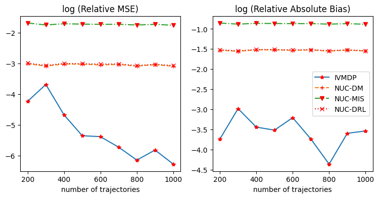
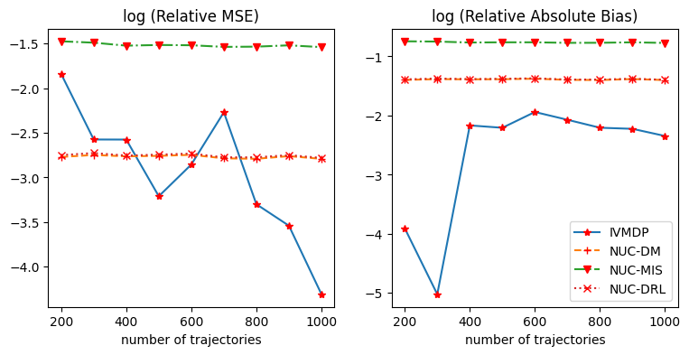
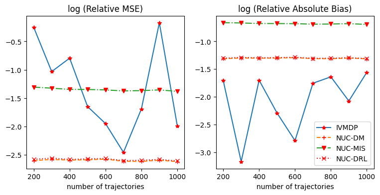
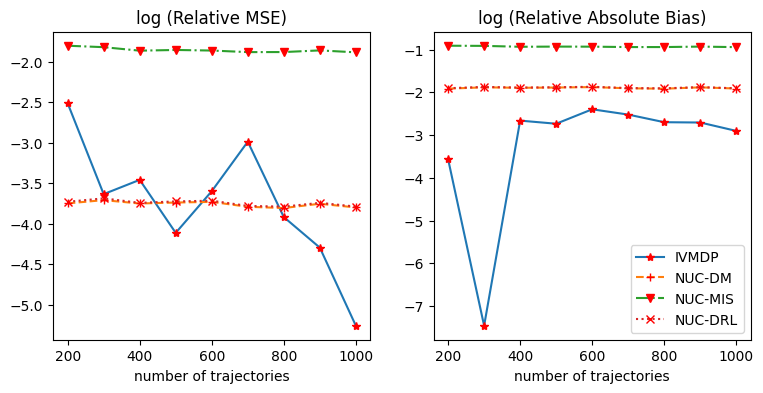
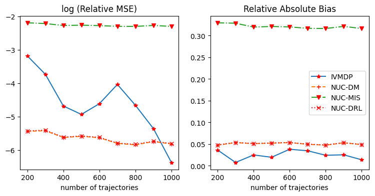

# ICML-Rebuttal
This repository provides ablation analysis results in ICML rebuttal, which is also added in Appendix D of our paper. All codes that support this analysis are provided in the 'IVMDP/ICML-Rebuttal/Simulation' folder.

Note: Please feel free to download ablation_analysis.html and open it in your browser if the markdown version doesn't work well. Thanks!

## Comparison
We conducted five groups of comparisons to compare the performance of our approach versus baselines in the cases where the effect of instrumental variables (IVs) or unmeasured confounders are relatively weak.

Same as our paper, we compare the performance of our approach, IVMDP, with three existing baselines under NUC assumptions. We denote them as NUC-DM, NUC-MIS, and NUC-DRL.

### Data Generating Process
In our paper, Figure 3 was obtained under the following data generating process:

$$
\begin{aligned}
&S_{01}\sim{N}(0,1),\\
&S_{02}\sim{N}(0,1)\\
&U_t\sim \text{Ber}(1,0.5)-0.5\\
&Z_t\sim\text{Ber}(1,\text{sigmoid}(S_{t1}+S_{t2}))\\
&A_t\sim\text{Ber}(1,\text{sigmoid}(S_{t1}+S_{t2}+2Z_t+0.5U_t))\\
&R_t\sim \text{Ber}(1,\text{sigmoid}(S_{t1}+S_{t2}+2A_t+2.5U_t))\\
&S_{t+1,1}=S_{t1}+U_t+A_t-0.5\\
&S_{t+1,2}=S_{t1}-U_t-A_t+0.5
\end{aligned}
$$

To weaken the effect of IV, we adjust the coefficient of $Z_t$ in the expression of $A_t$ as below:

1. **Medium strength IV**: $A_t\sim\text{Ber}(1,\text{sigmoid}(S_{t1}+S_{t2}+Z_t+0.5U_t))$

2.  **Weak IV**: $A_t\sim\text{Ber}(1,\text{sigmoid}(S_{t1}+S_{t2}+0.5Z_t+0.5U_t))$

To weaken the effect of unmeasured confounders, we adjust the coefficient of $U_t$ in the expresssion of $R_t$ as below:

1. **Medium strength confounders**: $R_t\sim \text{Ber}(1,\text{sigmoid}(S_{t1}+S_{t2}+2A_t+1.5U_t))$

2. **Weak confounders**: $R_t\sim \text{Ber}(1,\text{sigmoid}(S_{t1}+S_{t2}+2A_t+0.5U_t))$

Combining the above four cases with the original setting in the paper, we obtained five scenarios in total for the following comparisons.

### Figures
In this section, we present the figures we obtained under different scenarios. All results are obtained under 100 times of replications.

**Note**: the log(Relative Absolute Bias) of IVMDP may look very unstable in the following figures. This is because taking logarithm  greatly exagerated the difference between small positive values. The actual fluctuation without logarithm is actually very mild. Here we keep the logarithm transformation for all plots just for the convenience of parallel comparisons.

#### The original figure in the paper

#### Medium strength IV

#### Weak IV

#### Medium strength confounders

#### Weak confounders

### Conclusion

As we can see from the five groups of comparisons, the variance of IVMDP indeed increased when the effect of instrumental variables or confounders is weak. Despite so, the estimation bias of IVMDP is (almost) always the smallest in all settings. Moreover, although the MSE of IVMDP is relatively unstable compared with other approaches under NUC assumption, IVMDP has a potential to perform better than baseline methods when the number of trajectories increases, even in the case when IV or the unmeasured confounder is very weak. However, if the real data indicates either weak signals on the instrumental variable (IV) or unmeasured confounders, we recommend employing IVMDP only when a sufficient number of data points is available.
